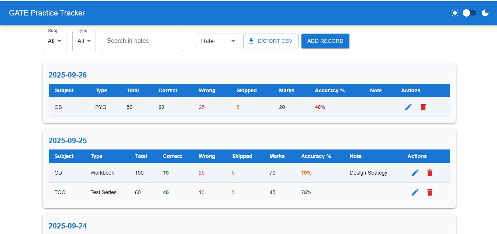
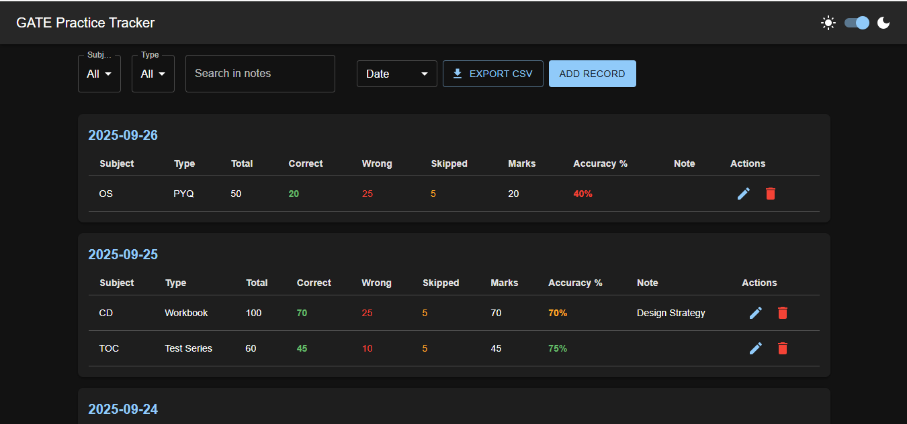

# Gate Practice Tracker 📝

A React-based web app to track study/test records with dark/light mode, filtering, export, and pagination. Built with **Vite** and **Material-UI**.

## 🎯 Use Cases

This app is especially useful for **GATE aspirants**, as it helps them track performance by subject, identify which topics need more focus, and monitor accuracy by comparing correct and wrong answers. Users can analyze time management by observing skipped or attempted questions, take notes on specific tests for future reference, and plan study sessions more effectively using filtered or grouped data. Additionally, the ability to export records allows for offline analysis or sharing with mentors. Overall, this app enables aspirants to improve their preparation strategy, focus on weak areas, and efficiently track their overall progress.

## ✨ Features

- **Record Management**: Add, edit, delete study/test records.
- **Filtering**: Filter by subject, type, date and note search.
- **Grouping**: Group records by date, subject, or type.
- **Pagination**: View records in pages (10 per page).
- **Dark/Light Mode**: Toggle theme for better readability.
- **CSV Export**: Export filtered records to CSV.
- **Responsive Footer**: Footer adapts to dark/light mode and shows copyright.
- **Custom Favicon**: Supports website icon in browser tab.

## 🖼 Screenshots

### ☀️ Light Mode



### 🌙 Dark Mode



## 🛠 Tech Stack

- **Frontend**: React, Vite
- **UI Components**: Material-UI (MUI)
- **State Management**: React `useState` + `useLocalStorage` hook

## 📂 Folder Structure

```plaintext
├─ public/
│ ├─ icon.png
│ ├─ light-mode.png
│ ├─ dark-mode.png
├─ src/
│ ├─ assets/
│ ├─ components/
│ │ ├─ Header.jsx
│ │ ├─ RecordForm.jsx
│ │ ├─ RecordGroup.jsx
│ │ ├─ Filters.jsx
│ │ ├─ ExportCSV.jsx
│ ├─ hooks/
│ │ └─ useLocalStorage.js
│ ├─ utils/
│ │ ├─ calcAccuracy.js
│ │ └─ csv.js
│ ├─ App.jsx
│ ├─ index.css
│ └─ main.jsx
├─ .gitignore
├─ eslint.config.js
├─ index.html
├─ package-lock.json
├─ README.md
├─ requirements.txt
├─ package.json
└─ vite.config.js
```

## ⚡ Installation

1. **Clone the repository:**

   ```bash
   git clone https://github.com/APMAPM1/Gate-Practice-Tracker.git
   cd GateTracker
   ```

2. **Install dependencies:**

   ```bash
   npm install
   ```

3. **Run the development server:**

   ```bash
   pip install -r requirements.txt
   ```

4. **Run:**

   ```bash
   npm run dev
   ```

5. **Open your browser at `http://localhost:5173/` (default Vite port)**

## 📜 License

© 2025 Adi Ajudia. All rights reserved.
